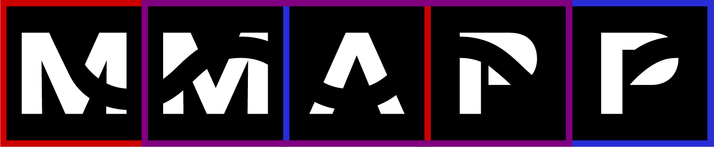

<h2 style="margin-bottom: 0px;" href="https://mmapptech.com/">mmapptech.com</h2>

[![CC BY-NC-ND 4.0][cc-by-nc-nd-shield]][cc-by-nc-nd]

This work is licensed under a
[Creative Commons Attribution-NonCommercial-NoDerivs 4.0 International License][cc-by-nc-nd].

[![CC BY-NC-ND 4.0][cc-by-nc-nd-image]][cc-by-nc-nd]

[cc-by-nc-nd]: http://creativecommons.org/licenses/by-nc-nd/4.0/
[cc-by-nc-nd-image]: https://licensebuttons.net/l/by-nc-nd/4.0/88x31.png
[cc-by-nc-nd-shield]: https://img.shields.io/badge/License-CC%20BY--NC--ND%204.0-lightgrey.svg

This repository features the base code for the development of the landing website for MMAPP Tech's innovative platform, featuring a comprehensive suite of applications designed specifically for the Mixed Martial Arts (MMA) sport.

Featuring a sleek layout with animations and 3D motion graphics showcasing MMAPP's main features and the many benefits it brings to Federations, their athletes, coaches, clubs and promoters.

<h3>Tech Stack:</h3>

* **Next.js**
* **Tailwind**
* **GSAP**
* **Three.js**

#### Development by [andreDmelo](https://andredmelo.dev/)